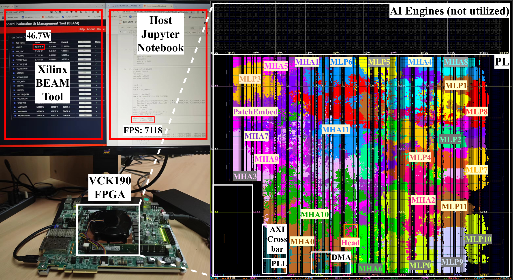
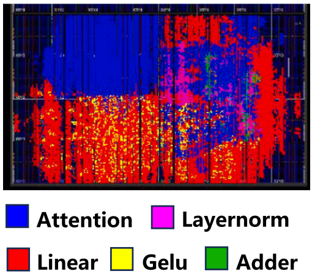

# HCC-FPGA
#### 介绍
Transformer 模型开源的 HLS / Verilog 实现

#### 说明
- 学习 HLS 可以复现 `gemm_hls`、`HG-PIPE`
- 学习 Verilog 可以尝试复现 `llama-FPGA`
- 由于DRViT没有开源仓库，这里就不上传源码了，想学习DRViT可以找我拿源码

#### 关于Vitis、Vivado
- 个人安装： 如果个人 PC 满足运行要求，可自行安装 Vitis、Vivado，并下载许可证及 U250、VCK190 等器件支持包。
- 服务器支持： 如果个人 PC 性能或环境受限，服务器端已提供预装好的 Vitis、Vivado 环境，可直接使用。

## 1. Edge-MoE
- 语言：HLS 实现 ViT（混合专家）
- 仓库地址：https://github.com/sharc-lab/Edge-MoE
- 复现情况：可以生成 IP 核
- 器件：ZCU102
- 备注：缺少 PS 端代码

## 2. llama-FPGA
- 语言：Verilog
- 仓库地址：https://github.com/adamgallas/llama-fpga
- 复现情况：暂未复现
- 器件：KV260、ZCU104、U250

## 3. HG-PIPE
- 语言：HLS 实现 ViT
- 仓库地址：https://github.com/hguq/HG-PIPE
- 复现情况：可以布局布线
- 器件：VCK190

## 4. gemm_hls（比较简单，可先从这个开始）
- 语言：HLS 实现矩阵乘法
- 仓库地址：https://github.com/spcl/gemm_hls
- 复现情况：暂未复现
- 器件：U250

## 5. DRViT
- 语言：Verilog 实现 ViT
- 复现情况：可以布局布线
- 器件：U250
- 备注：只有4个layer（完整ViT是12个），量化计算不严谨

